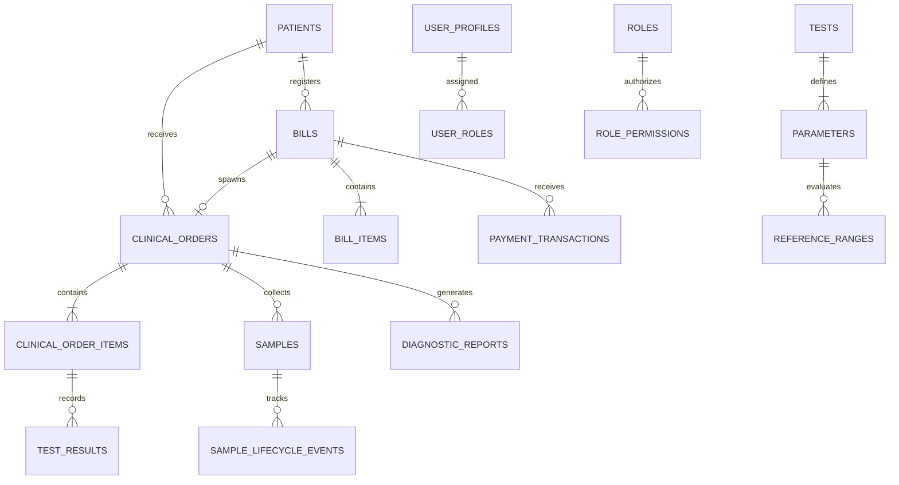

# BIMAL PATHOLOGY & DIAGNOSTIC CENTER
## PostgreSQL Cloud Database Architecture Specification (Phase 0)

### 1. Architectural Foundations

- **Strict Integer Paisa Currency Representation**: Floating-point types are strictly forbidden for all financial calculations. All monetary fields (`gross_amount_paisa`, `discount_amount_paisa`, `net_amount_paisa`, `paid_amount_paisa`, `due_amount_paisa`, `unit_price_paisa`, `price_paisa`) are stored as PostgreSQL `BIGINT`.
  - 1 NPR = 100 Paisa (e.g. NPR 1,500.00 is stored as `150000`).
- **Primary Keys**: PostgreSQL `UUID` (`uuid_generate_v4()`) for robust distributed integrity.
- **Timestamps**: All temporal fields use `TIMESTAMPTZ` (UTC) with client-side localization for AD / BS display.
- **Immutable Snapshots**: Patient demographics and clinician details are captured as immutable snapshots on bills and diagnostic reports so future master updates never corrupt historical legal records.

---

### 2. Core Entity Relational Structure

---

### 3. Detailed Table Dictionary

| Table Name | Description | Key Columns & Constraints |
|---|---|---|
| `user_profiles` | Cloud accounts linked to `auth.users` | `id (UUID PK)`, `email`, `full_name`, `is_super_admin`, `is_active` |
| `roles` | System & Custom Roles | `id (UUID PK)`, `code (UNIQUE)`, `name`, `is_system` |
| `role_permissions` | Granular permission assignments per role | `role_id (FK)`, `permission_key (VARCHAR)` |
| `user_roles` | Role assignment mapping | `user_id (FK)`, `role_id (FK)` |
| `user_direct_permissions` | Direct user permission overrides | `user_id (FK)`, `permission_key`, `is_granted` |
| `referring_doctors` | External referring doctors & institutions | `id (UUID PK)`, `full_name`, `code`, `degree`, `institution`, `phone` |
| `reporting_personnel` | Internal laboratory signatories | `id (UUID PK)`, `user_id (FK)`, `full_name`, `professional_type`, `registration_council`, `registration_number`, `can_sign_reports` |
| `patients` | Patient master (Created only from New Bill) | `id (UUID PK)`, `uhid (UNIQUE)`, `mobile (INDEXED)`, `full_name`, `gender`, `dob`, `address` |
| `bills` | Financial bill master | `id (UUID PK)`, `bill_number (UNIQUE)`, `patient_id (FK)`, `gross_amount_paisa`, `net_amount_paisa`, `paid_amount_paisa`, `due_amount_paisa`, `payment_status` |
| `bill_items` | Items within a financial bill | `id (UUID PK)`, `bill_id (FK)`, `test_id (UUID)`, `reporting_type`, `unit_price_paisa`, `net_price_paisa` |
| `payment_transactions` | Atomic payments and receipts | `id (UUID PK)`, `bill_id (FK)`, `receipt_number (UNIQUE)`, `amount_paisa`, `payment_mode` |
| `clinical_orders` | Clinical lab orders (Lab No.) | `id (UUID PK)`, `bill_id (FK)`, `patient_id (FK)`, `order_number (UNIQUE)`, `order_date_ad`, `order_date_bs`, `status` |
| `clinical_order_items` | Individual reportable tests | `id (UUID PK)`, `order_id (FK)`, `bill_item_id (FK)`, `test_id (FK)`, `reporting_type`, `status`, `sample_id (FK)` |
| `samples` | Specimens collected & barcodes | `id (UUID PK)`, `barcode (UNIQUE)`, `order_id (FK)`, `specimen_type`, `container_type`, `status`, `recollected_from_sample_id (Lineage)` |
| `sample_lifecycle_events` | Append-only sample status transitions | `id (UUID PK)`, `sample_id (FK)`, `from_status`, `to_status`, `reason`, `performed_by`, `timestamp` |
| `tests` | Master investigations & profiles | `id (UUID PK)`, `code (UNIQUE)`, `name`, `department`, `reporting_type`, `price_paisa`, `sample_type`, `container` |
| `parameters` | Measurable parameters and formulas | `id (UUID PK)`, `test_id (FK)`, `code`, `name`, `value_type`, `unit`, `formula`, `formula_dependencies` |
| `reference_ranges` | Demographic reference intervals | `id (UUID PK)`, `parameter_id (FK)`, `gender`, `age_min_days`, `age_max_days`, `normal_min`, `normal_max`, `critical_low`, `critical_high` |
| `test_results` | Entered parameter values & flags | `id (UUID PK)`, `order_item_id (FK)`, `parameter_id (FK)`, `numeric_value`, `display_value`, `flag`, `is_critical`, `critical_acknowledged`, `status` |
| `diagnostic_reports` | Signed immutable pathology reports | `id (UUID PK)`, `order_id (FK)`, `report_number (UNIQUE)`, `version`, `is_amendment`, `integrity_hash`, `clinical_snapshot_json`, `signed_by_personnel_id` |
| `audit_logs` | Append-only security & clinical log | `id (UUID PK)`, `user_id (FK)`, `action`, `entity_type`, `entity_id`, `old_data (JSONB)`, `new_data (JSONB)`, `timestamp` |

---

### 4. Reporting Types Engine

1. **`InHouse`**:
   - Creates `bill_items` + `clinical_orders` + `samples` + `clinical_order_items` + `test_results` + `diagnostic_reports`.
   - Full in-lab accessioning, entry, verification, and Bimal A4 PDF report.
2. **`OutsourceWithBimalReport`**:
   - Creates `bill_items` + `clinical_orders` + `samples` (tracking) + `clinical_order_items` + `test_results` + `diagnostic_reports`.
   - Result entered upon receipt from reference laboratory. Bimal A4 PDF clearly discloses external reference laboratory name.
3. **`NoReporting` (Financial Bill Only)**:
   - Creates `bill_items` + `payment_transactions`.
   - **Strictly suppresses**: `clinical_orders`, `samples`, barcodes, worklist entry, verification, and PDF generation.
