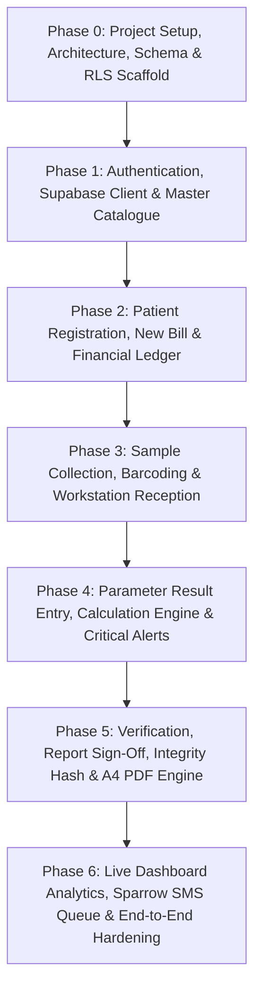

# BIMAL PATHOLOGY & DIAGNOSTIC CENTER
## Implementation Roadmap & Phased Execution Plan

---

### Overview of Planned Phases

---

### Phase 0: Project Initialization, Architecture, Schema & RLS Scaffold (COMPLETED)
- [x] Clean directory initialization at `G:\bimal_pathology_cloud`.
- [x] Scaffold React 19 + TypeScript + Vite + MUI 6 + React Router 7 + TanStack Query 5 + React Hook Form + Zod.
- [x] Establish feature-oriented directory structure.
- [x] Configure Supabase client with `.env.example`.
- [x] Draft complete PostgreSQL schema with integer paisa `BIGINT` math, constraints, and audit tables.
- [x] Draft Row Level Security (RLS) policies and granular permission matrix.
- [x] Implement UI layout, navigation, role switching, mock screens, and build/lint verification.

---

### Phase 1: Authentication, Granular Access Control & Masters
- Connect live Supabase project.
- Implement user login, session recovery, password reset.
- Sync user roles and permissions dynamically via Supabase RLS.
- Implement full CRUD for:
  - Test Catalogue, Parameters, Reference Ranges, Calculation Formulas.
  - Referring Clinicians & Hospital Affiliations.
  - Reporting Personnel with Council Registrations & Digital Signatures.
  - User Accounts & Permission Assignment.

---

### Phase 2: Patient Registry, New Bill & Financial Posting
- Enforce strict **Patient Rule**:
  - Primary lookup by mobile number.
  - Auto-load existing UHID / Prevent duplicates.
  - Create patient solely during billing.
- Atomic billing procedure:
  - Integer paisa math (`gross - discount = net`, `net - paid = due`).
  - Support payment modes (Cash, Fonepay, eSewa, Khalti, Card, Bank, Credit).
  - Generate printable financial receipts.
  - Handle reporting types: `InHouse`, `OutsourceWithBimalReport`, `NoReporting`.

---

### Phase 3: Sample Collection, Barcode Tracking & Reception
- Automatic sample grouping by specimen and container.
- Barcode generation (`SMP-YYYY-NNNNN`).
- Collection marking and sample accessioning.
- Rejection workflow with mandatory clinical reason.
- Recollection order generation with preserved lineage.
- Append-only lifecycle event history.

---

### Phase 4: Metadata-Driven Result Engine & Critical Alerts
- Worklist filtering by department and status.
- Metadata-driven result entry: Numeric, Text, Select, Boolean, Heading, Calculated.
- Automated flag evaluation: Normal, Low, High, CriticalLow, CriticalHigh, Abnormal, NoRange.
- Dependency-checked calculated parameters (e.g. Globulin, A:G Ratio, eGFR).
- Mandatory Critical Alert Acknowledgment barrier before verification.

---

### Phase 5: Verification, Sign-Off, Report Immutability & A4 PDF
- Technologist verification and Consultant Pathologist sign-off.
- Order-level readiness checking (`NoReporting` does not block readiness).
- Frozen clinical snapshots & SHA-256 integrity hashing.
- Professional A4 PDF Generator:
  - Bilingual header with ~6cm header zone.
  - Faint background watermark, no QR box.
  - Single BS date on Registered line; Collected/Received/Reported in AD.
  - Reference laboratory disclosure for outsourced tests.
  - Multi-page pagination, signature blocks, council numbers.
  - Versioned amendments (`version >= 2`) with audit trail.

---

### Phase 6: Operational Dashboard, Sparrow SMS & Production Hardening
- Real-time live dashboard metrics.
- Department workload visualization.
- Sparrow SMS queue architecture (bill confirmation, report ready).
- Performance audit, database index tuning, and production build deployment.
